# Supervised learning with quantum-enhanced feature spaces

Vojtěch Havlíček1,2, Antonio D. Córcoles1*, Kristan Temme1*, Aram W. Harrow3, Abhinav Kandala1, Jerry M. Chow1 & Jay M. Gambetta1

Machine learning and quantum computing are two technologies that each have the potential to alter how computation is performed to address previously untenable problems. Kernel methods for machine learning are ubiquitous in pattern recognition, with support vector machines (SVMs) being the best known method for classification problems. However, there are limitations to the successful solution to such classification problems when the feature space becomes large, and the kernel functions become computationally expensive to estimate. A core element in the computational speed-ups enabled by quantum algorithms is the exploitation of an exponentially large quantum state space through controllable entanglement and interference. Here we propose and experimentally implement two quantum algorithms on a superconducting processor. A key component in both methods is the use of the quantum state space as feature space. The use of a quantum-enhanced feature space that is only efficiently accessible on a quantum computer provides a possible path to quantum advantage. The algorithms solve a problem of supervised learning: the construction of a classifier. One method, the quantum variational classifier, uses a variational quantum circuit $^{1,2}$ to classify the data in a way similar to the method of conventional SVMs. The other method, a quantum kernel estimator, estimates the kernel function on the quantum computer and optimizes a classical SVM. The two methods provide tools for exploring the applications of noisy intermediate-scale quantum computers $^{3}$ to machine learning.

The intersection between machine learning and quantum computing has attracted considerable attention in recent years $^{4-6}$ . This has led to a number of recently proposed quantum algorithms $^{1,2,7-9}$ . Here we present two quantum algorithms that have the potential to run on nearterm quantum devices. A suitable class of algorithms for such noisy devices employs short-depth circuits, because they are amenable to error-mitigation techniques that reduce the effect of decoherence $^{10,11}$ . There are convincing arguments to indicate that even very simple circuits are hard to simulate classically $^{12,13}$ . The algorithm we propose takes on the original problem of supervised learning: the construction of a classifier. For this problem, we are given data from a training set $T$ and a test set $S$ of a subset $\Omega \subset \mathbb{R}^d$ . Both are assumed to be labelled by a map $m: T \cup S \to \{+1, -1\}$ unknown to the algorithm. The training algorithm receives only the labels of the training data $T$ . The goal is to infer an approximate map on the test set $\widetilde{m}: S \to \{+1, -1\}$ such that it agrees with high probability with the true map $m(s) = \widetilde{m}(s)$ on the test data $s \in S$ . For this task to be meaningful it is assumed that there is a correlation between the labels given for training and the true map. A classical approach to this problem uses so-called support vector machines (SVMs) $^{14}$ . A quantum version of this approach has already been proposed in ref. $^{15}$ , where an exponential improvement can be achieved if data is provided in a coherent superposition. However, when data is provided in the conventional way, that is, from a classical computer, then the methods of ref. $^{15}$ do not yield this speed-up.

Here we propose two binary classifiers that process data that is provided classically and use the quantum state space as feature

space. The data is mapped non-linearly to a quantum state $\varPhi: x \in \Omega \rightarrow |\varPhi(x)\rangle \langle \varPhi(x)|$ ; see Fig. 1a. In the first approach we use a variational circuit as given in refs $^{1,2,16,17}$ followed by a binary measurement. Any binary measurement that classifies the data based on the probability of observing one outcome over the other implements a separating hyperplane in state space. Like an SVM, this approach constructs a linear decision function in feature space. The second approach builds on this observation and constructs the hyperplane using a classical SVM, only using the quantum computer to estimate the kernel function. This second approach inherits the performance guarantees from the classical SVM. We implement both classifiers on a superconducting quantum processor with five coupled superconducting transmons, only two of which are used in this work, as shown in Fig. 2a. In the experiment, we want to separate the question of whether the classifier can be implemented in hardware from the problem of choosing a suitable feature map for a practical dataset. The data that are classified here are chosen so that they can be classified with $100\%$ success to verify the method. We experimentally demonstrate that this success ratio is achieved.

Training and classification with conventional SVMs is efficient when inner products between feature vectors can be evaluated efficiently $^{14,18,19}$ . Classifiers based on quantum circuits, such as the one presented in Fig. 2c, cannot provide a quantum advantage over a conventional SVM if the feature vector kernel $K(\pmb{x},\pmb{z}) = |\langle \varPhi(\pmb{x})|\varPhi(\pmb{z})\rangle|^2$ can be computed efficiently on a classical computer. For example, a classifier that uses a feature map that generates only product states can be evaluated in time $\mathcal{O}(n)$ for $n$ qubits. To obtain an advantage over classical approaches we need to implement a map based on circuits that are hard to simulate classically. Since quantum computers are not expected to be classically simulable, there exists a long list of (universal) circuit families we can choose from. Here we use a circuit that works well in our experiments and is not too deep. We define a feature map on $n$ -qubits generated by the unitary $\mathcal{U}_{\varPhi(\pmb{x})}=U_{\varPhi(\pmb{x})}H^{\otimes n}U_{\varPhi(\pmb{x})}H^{\otimes n}$ , where $H$ denotes the conventional Hadamard gate and

$$
U _ {\Phi (\boldsymbol {x})} = \exp \left(i \sum_ {S \subseteq [ n ]} \phi_ {S} (\boldsymbol {x}) \prod_ {i \in S} Z _ {i}\right)
$$

is a diagonal gate in the Pauli $Z$ -basis; see Fig. 1b. This circuit acts on the initial state $|0\rangle^n$ . We use the coefficients $\phi_S(x) \in \mathbb{R}$ to encode the data $x \in \Omega$ . In general any diagonal unitary $U_{\varPhi(\pmb{x})}$ can be used if it can be implemented efficiently. This is, for instance, the case when only weight $|S| \leq 2$ interactions are considered. The exact evaluation of the inner product between two states generated from a similar circuit with only a single diagonal layer $U_{\varPhi(x)}$ is $\# P$ -hard20. Nonetheless, in the experimentally relevant context of additive error approximation, simulation of a single-layer preparation circuit can be achieved efficiently classically by uniform sampling21. We conjecture that the additive error approximation of inner products generated from circuits with two Hadamard layers and diagonal gates is hard classically; see Supplementary Information for a discussion.

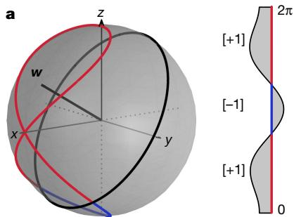

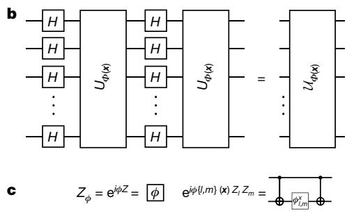  
Fig. 1 | Quantum kernel functions. a, Feature map representation for a single qubit. A classical dataset in the interval $\Omega = (0,2\pi]$ with binary labels (a, right) can be mapped onto the Bloch sphere (red and blue lines) by using the non-linear feature map described in b. For a single qubit $U_{\varPhi(x)}=Z_x$ is a phase-gate of angle $x\in \Omega$ . The mapped data can be separated by the hyperplane given by normal $w$ . States with a positive expectation value of $w$ receive a $[+1]$ (red) label, while negative values are

To test our two methods, we generate artificial data that can be fully separated by our feature map. We use the map for $n = d = 2$ qubits in Fig. 1b with $\phi_{\{i\}}(\pmb{x}) = x_i$ and $\phi_{\{1,2\}}(\pmb{x}) = (\pi - x_1)(\pi - x_2)$ . We generate the labels for data vectors $\pmb{x} \in T \cup S \subset (0, 2\pi]^2$ , by first choosing $f = Z_1Z_2$ and a random unitary $V \in SU(4)$ . To vary the distribution of the data in the experiments three different unitaries were chosen at random. Once a unitary is fixed we sample the data points $\pmb{x}$ and assign $m(\pmb{x}) = \pm 1$ , when $\langle \varPhi(\pmb{x}) | V^\dagger fV | \varPhi(\pmb{x}) \rangle \geq \varDelta$ and $m(\pmb{x}) = -1$ when $\langle \varPhi(\pmb{x}) | V^\dagger fV | \varPhi(\pmb{x}) \rangle \leq -\varDelta$ ; see Fig. 3b. The data has been separated by a gap of $\varDelta = 0.3$ . For each unitary, multiple training sets and classification sets each consisting of 20 data points per label were chosen uniformly at random. We show one such classification set as circle symbols in Fig. 3b.

The first classification protocol, quantum variational classification, follows four steps. First, the data $\pmb{x} \in \Omega$ is mapped to a quantum state by applying the feature map circuit $\mathcal{U}_{\varPhi(\pmb{x})}$ in Fig. 1b to $|0\rangle^n$ . Second, a short-depth quantum circuit $W(\pmb{\theta})$ , described in Fig. 2b, is applied to the feature state. This circuit with $l$ layers is parameterized by $\pmb{\theta} \in \mathbb{R}^{2n(l + 1)}$ and will be optimized during training. Third, for a two-label $y \in \{+1, -1\}$ classification problem, a binary measurement $\{M_y\}$ diagonal in the $Z$ -basis is applied to the state $W(\pmb{\theta})\mathcal{U}_{\varPhi(\pmb{x})}|0\rangle^n$ . Any measurement of this form can be written as $M_y = 2^{-1}(1 + yf)$ , when $f = \sum_{z \in \{0,1\}^n} f(z)|z\rangle \langle z|$ for some Boolean function $f: \{0,1\}^n \rightarrow \{+1, -1\}$ . This is implemented by measuring in the $Z$ -basis and applying $f$ to the output bit-string. The probability of obtaining outcome $y$ is $p_y(x) = \langle \varPhi(x)|W^\dagger(\pmb{\theta})M_yW(\pmb{\theta})|\varPhi(x)\rangle$ . Fourth, for the decision rule we perform $R$ repeated measurement shots to obtain the empirical distribution $\hat{p}_y(x)$ . We assign the label $\tilde{m}(x) = y$ , whenever $\hat{p}_y(x) > \hat{p}_{-y}(x) - yb$ , where we have introduced an additional bias parameter $b \in [-1,1]$ that can be optimized during training.

The feature map circuit $\mathcal{U}_{\Phi(x)}$ , as well as the Boolean function $f$ , are fixed choices. During the training of the classifier we optimize the parameters $(\theta, b)$ . For the optimization, we need to define a cost function. For a single training sample we use the error probability $\operatorname*{Pr}(\widetilde{m}(\boldsymbol{x}) \neq m(\boldsymbol{x}))$ of assigning the wrong label from the empirical distribution with $R$ shots. We optimize the empirical risk $R_{\mathrm{emp}}(\theta)$ given by the error probability averaged over the full training set $T$ . See Supplementary Information for details.

The experiment itself is split into two phases; First, we train the classifier and optimize $(\theta, b)$ . We have found that Spall's simultaneous perturbation stochastic approximation (SPSA)[22,23] algorithm performs well in the noisy experimental setting. We can use the circuit as a classifier after the parameters have converged to $(\theta^{*}, b^{*})$ . Second, in the classification phase, the classifier assigns labels to unlabelled data $s \in S$ according to the decision rule $\widetilde{m}(s)$ .

We implement the quantum variational classifier $W(\pmb{\theta})$ for five different depths ( $l = 0$ to $l = 4$ ) (see Fig. 2b), on the superconducting

labelled $[-1]$ (blue). b, For the general circuit $U_{\varPhi(x)}$ is formed by products of single- and two-qubit unitaries that are diagonal in the computational basis. In our experiments, both the training and testing data are artificially generated to be perfectly classifiable using the feature map. The circuit family depends non-linearly on the data through the coefficients $\phi_S(x)$ with $|S| \leq 2$ . c, Experimental implementation of the parameterized diagonal single- and two-qubit operations using CNOTs and $Z$ -gates.

quantum processor. We expect a higher classification success for increased depth. The binary measurement is obtained from the parity function $f = Z_{1}Z_{2}$ . For each depth we generate data from three different random unitaries. We use training sets consisting of 20 data points per label. The data from one of these unitaries, together with a training set, is shown in Fig. 3b.

The optimization of the empirical risk $R_{\mathrm{emp}}(\pmb{\theta})$ is shown in Fig. 3a for two different training sets and depths. In all experiments throughout this work we implemented an error mitigation technique that relies on zero-noise extrapolation to first order[10,24]. To obtain a zero-noise estimate, a copy of the circuit was run on a timescale slowed down by a factor of 1.5; see Supplementary Information. This technique is

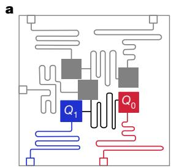

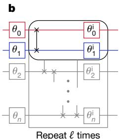

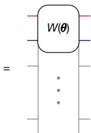

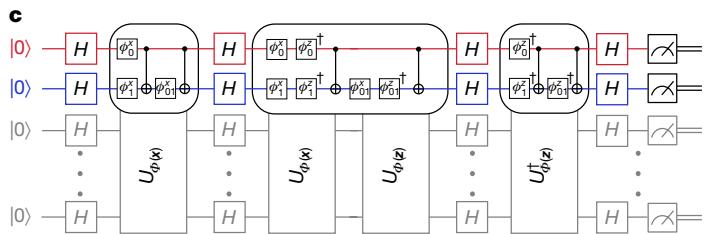  
Fig. 2 | Experimental implementations. a, Schematic of the five-qubit quantum processor. The experiment was performed on qubits $Q_{0}$ and $Q_{1}$ , highlighted in the image. b, Variational circuit used for our optimization method. The two top qubits depict the circuit implemented. We choose a common ansatz for the variational unitary $W(\pmb{\theta}) = U_{\mathrm{loc}}^{(l)}(\theta_l)U_{\mathrm{ent}}\dots U_{\mathrm{loc}}^{(2)}(\theta_2)U_{\mathrm{ent}}U_{\mathrm{loc}}^{(1)}(\theta_1)^{16,17}$ . We alternate layers of entangling gates $U_{\mathrm{ent}} = \prod_{(i,j)\in E}\mathsf{CZ}(i,j)$ with full layers of single-qubit rotations $U_{\mathrm{loc}}^{(t)}(\theta_t) = \otimes_{i = 1}^n U(\theta_{i,t})$ with $U(\theta_{i,t})\in \mathrm{SU}(2)$ . For the entangling step we use controlled- $Z$ phase gates $\mathbf{CZ}(i,j)$ along the edge (0, 1) of the interaction graph $E$ of the superconducting chip. The grey background illustrates the scaling to a larger number of qubits. c, Circuit to directly estimate the fidelity between a pair of feature vectors for data $x$ and $z$ as used for our second method. The circuit on $Q_{0}$ , $Q_{1}$ depicts the circuit implemented, while the grey background illustrates the general structure of the circuit. The circuit is comprised of Hadamard gates $H$ interleaved with the diagonal unitary $U_{\phi (x)}$ parameterized by $\phi_S(x)$ to directly estimate the fidelity between a pair of feature vectors for data $x$ and $z$ as used for our second method.

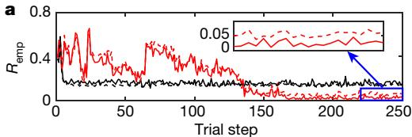

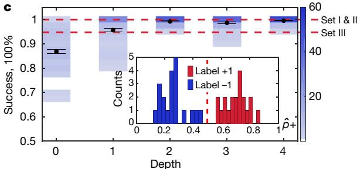

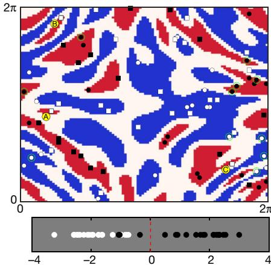  
b   
Fig. 3 | Convergence of the method and classification results. a, Convergence of the cost function $R_{\mathrm{emp}}(\theta)$ after 250 iterations of Spall's SPSA algorithm. Red (or black) curves correspond to $l = 4$ (or $l = 0$ ). The cost function with $\hat{P}_k$ estimates obtained from zero-noise extrapolation (solid lines) is compared to the cost function with unmitigated estimates (dashed). We train three datasets per depth and perform 20 classifications per trained set. c, The classifications results are shown as blue histograms for all three randomly chosen unitaries (a total of 60 classifications per depth and 20 data points per classification per label), with mean values represented by black dots. The error bar is the standard error of the mean. The inset shows histograms as a function of the probability of measuring label +1 for one test set of 20 points per label obtained with an $l = 4$ classifier circuit, depicting classification of this set with 100% success.

implemented at each trial step, and the mitigated cost function is fed to the classical optimizer. We observe that the empirical risk in Fig. 3a converges to a lower value for depth $l = 4$ than for $l = 0$ , albeit with more optimization steps. The number of shots is an explicit parameter in $\operatorname{Pr}(\widetilde{m}(\boldsymbol{x}) \neq m(\boldsymbol{x}))$ . We set $R = 200$ to obtain a smoother cost function, even though we used 2,000 shots in the experiment to estimate $\hat{p}_{\nu}$ .

After each training is completed, we use the trained parameters $(\theta^{*}, b^{*} = 0)$ to classify 20 different test sets—where each set of 20 inputs with plus labels and 20 inputs with minus labels is drawn uniformly at random for each of the three different random unitaries. We run these classification experiments at 20,000 shots, versus the 2,000 used for training. The classification of each data point is error-mitigated. Figure 3c shows the classification results for our quantum variational approach. We observe an increase in classification success with increasing circuit depth (see Fig. 3c), reaching values very close to $100\%$ for depths larger than 1. This classification success remarkably persists to depth 4, despite the decoherence associated with eight CNOTs in the training and classification circuits, for $l = 4$ .

The binary measurement of the variational circuit classifier corresponds to a separating hyperplane in the quantum feature space and implements a linear threshold function as used in a conventional SVM $^{14,18}$ . To see this, we write $p_{y}(\pmb{x}) = 2^{-1}(1 + y \langle \Phi(\pmb{x}) | W^{\dagger}(\pmb{\theta}) f W(\pmb{\theta}) | \Phi(\pmb{x}) \rangle)$ . If we now define $W^{\dagger}(\pmb{\theta}) f W(\pmb{\theta}) = \pmb{w}$ and the state $\varPhi(\pmb{x}) = |\varPhi(\pmb{x})\rangle \langle \varPhi(\pmb{x})|$ , the ideal decision rule $p_{y}(\pmb{x}) > p_{-y}(\pmb{x}) - y b$ corresponds to the labelling function $\widetilde{m}(x) = \mathrm{sign}(\mathrm{tr}[w \varPhi(\pmb{x})] + b)$ . The trace is read as the Hilbert-Schmidt inner product between the normal vector $\pmb{w}$ and the mapped datum $\varPhi(\pmb{x})$ . This provides the motivation to interpret the quantum state space as feature space with vectors $|\varPhi(\pmb{x})\rangle \langle \varPhi(\pmb{x})|$ and inner products $K(\pmb{x},\pmb{z}) = |\langle \varPhi(\pmb{x})|\varPhi(\pmb{z})\rangle|^2$ . We note that the use of $\mathcal{H} = (\mathbb{C}^2)^{\otimes n}$ as feature space would lead to a conceptual problem since a vector $|\varPhi(\pmb{x})\rangle \in \mathcal{H}$ is only physically defined up to a global phase.

A shallow variational circuit can restrict the possible hyperplane normal $\pmb{w}$ . An unrestricted optimization over all hyperplanes, such as the standard Wolfe-dual of the SVM $^{14}$ , can be used when the kernel $K(\pmb{x}, \pmb{z})$ is known. This optimization problem only depends on $|T|$ variables and is concave whenever $K(\pmb{x}_i, \pmb{x}_j)$ is positive semi-definite.

The dashed red lines show the results of our direct kernel estimation method for comparison, with Sets I and II yielding $100\%$ success and Set III yielding $94.75\%$ success. b, Example data used for both methods in this work. The data labels (red for $+1$ label and blue for $-1$ label) are generated with a gap of $\Delta = 0.3$ (white areas). The training set with 20 points per label is shown as white and black circles. For the quantum kernel estimation method we show the support vectors (green circles) and a classified test set (white and black squares). Three points are misclassified, labelled as A, B and C. For each of the test data points $s_j$ we plot

$\sum_{i}y_{i}\alpha_{i}^{*}K(\pmb{x}_{i},\pmb{s}_{j})$ at the bottom of $\mathbf{b}$ . Points A, B and C, all belonging to label $+1$ , give $\sum_{i}y_{i}\alpha_{i}^{*}K(\pmb{x}_{i},\pmb{s}_{j}) = -1.033, -0.367$ and $-1.082$ , respectively.

This means that the unique, optimal solution can be found with polynomial resources in the training set size.

The second classification protocol, quantum kernel estimation, uses this connection to implement a conventional SVM with this kernel directly. The quantum computer is used twice in this protocol. First, the kernel $K(\pmb{x}_i, \pmb{x}_j)$ is estimated on a quantum computer for all pairs of training samples $\pmb{x}_i, \pmb{x}_j \in T$ ; see Fig. 2c. This kernel is then used in the Wolfe-dual SVM to find the optimal hyperplane. In the classification phase the quantum computer is used a second time to estimate the kernel $K(\pmb{x}_i, \pmb{s})$ for a new datum $s \in S$ and the support vectors from the

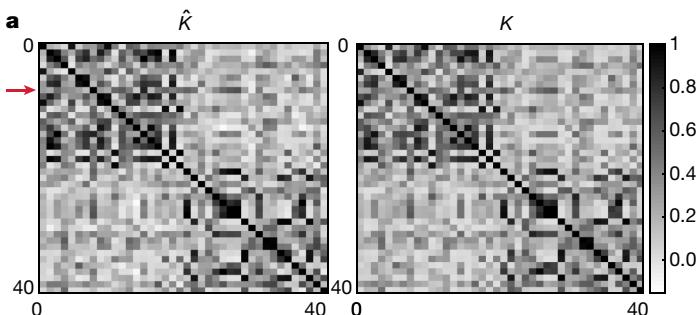

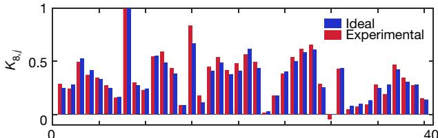  
Fig. 4 | Kernels for Set III. a, Experimental (left) and ideal (right) kernel matrices containing the inner products of all data points used for training Set III (round symbols in Fig. 3b). The maximal deviation from the ideal kernel $|K - \hat{K}|$ occurs at element $K_{8,15}$ . A cut through row 8 (indicated by the red arrow in a) is shown in b, where the experimental (or ideal) results are shown as red (or blue) bars. We note that entries that are close to zero in the kernel can become negative (such as $K_{8,30}$ in b) when the erromitigation technique is applied.

set $x_{i} \in T$ obtained from the optimization. This is sufficient to construct the full SVM classifier. A detailed description is provided in Supplementary Information.

To estimate the inner product for the kernel, standard methods could be used[25,26]. However, since the feature map circuits are given, the overlap can be estimated directly from the transition amplitude $|\langle \varPhi(x) | \varPhi(z) \rangle|^2 = |\langle 0^n | \mathcal{U}_{\varPhi(x)}^\dagger \mathcal{U}_{\varPhi(z)} | 0^n \rangle|^2$ . First, we apply the circuit Fig. 2c, a composition of two feature map circuits to $|0^n\rangle$ . Then, we measure the final state in the $Z$ -basis $R$ times and record the frequency of observing the $0^n$ string. This frequency is the estimate of the transition probability. Each kernel entry is obtained to an additive sampling error of $\epsilon$ when $\mathcal{O}(\epsilon^{-2})$ shots are used. In the training phase a total of $\mathcal{O}(|T|^2)$ amplitudes have to be estimated. An estimator $\hat{K}$ for the kernel matrix that deviates with high probability in operator norm from the exact kernel $K$ by at most $||K - \hat{K}|| \leq \delta$ can be obtained with $R = \mathcal{O}(\delta^{-2} |T|^4)$ shots in total. The sampling error can compromise the positive semidefiniteness of the kernel. Although not applied in this work, this can be remedied by employing an adaption of the scheme presented in ref.[27].

For the experimental implementation of estimating the kernel matrix $\hat{K}$ (see circuit in Fig. 2c), we again apply the error-mitigation protocol $^{10,24}$ to first order. We use 50,000 shots per matrix entry. We run the training stage on data obtained from three different unitaries, which we will label as Set I, Set II and Set III. Set III is shown in Fig. 3b. The training data used to obtain the kernel and the support vectors are the same data used in the training of our variational classifier. The support vectors (green circles in Fig. 3b) are then used to classify ten different test sets randomly drawn from each entire set. Set I and Set II each yield $100\%$ success over the classification of all ten different test sets, whereas Set III averages a success of $94.75\%$ . For more details see Supplementary Information. These classification results are given in Fig. 3c as dashed red lines to compare with the results of our variational method. In Fig. 4a we show the ideal and the experimentally obtained kernel matrices, $K$ and $\hat{K}$ , for Set III. The largest deviation between $K$ and $\hat{K}$ is found in row (or column) 8, depicted in Fig. 4b. All support vectors for the three sets and equivalent plots are given in Supplementary Information.

The two classifiers—a variational quantum classifier and a quantum kernel estimator—build upon the realization that a feature map that is hard to estimate classically is an important part of creating a quantum advantage. This realization enables us to search for machine learning algorithms that are accessible to noisy intermediate-scale (NISQ) devices. It will be intriguing to develop suitable feature maps for quantum state spaces, which have a provable quantum advantage while providing a substantial improvement on real-world datasets. Given the ubiquity of kernel methods in machine learning, we are optimistic that our technique will extend application beyond binary classification. Our experiments also highlight the impact of noise on the success of such hybrid algorithms, and demonstrate that these error-mitigation techniques present a route to accurate classification even with NISQ hardware.

During the preparation of this manuscript we became aware of the independent theoretical work by Schuld et al.[28,29].

# Data availability

All data generated or analysed during this study are included in this Letter (and its Supplementary Information).

# Online content

Any methods, additional references, Nature Research reporting summaries, source data, statements of data availability and associated accession codes are available at https://doi.org/10.1038/s41586-019-0980-2.

Received: 26 June 2018; Accepted: 16 January 2019

Published online 13 March 2019.

1. Mitarai, K., Negoro, M., Kitagawa, M. & Fujii, K. Quantum circuit learning. Preprint at https://arxiv.org/abs/1803.00745 (2018).   
2. Farhi, E. & Neven, H. Classification with quantum neural networks on near term processors. Preprint at https://arxiv.org/abs/1802.06002 (2018).   
3. Preskill, J. Quantum computing in the NISQ era and beyond. Preprint at https://arxiv.org/abs/1801.00862 (2018).

4. Arunachalam, S. & de Wolf, R. Guest column: a survey of quantum learning theory. SIGACT News 48, 41-67 (2017).   
5. Ciliberto, C. et al. Quantum machine learning: a classical perspective. Proc. R. Soc. Lond. A 474, 20170551 (2018).   
6. Dunjko, V. & Briegel, H. J. Machine learning & artificial intelligence in the quantum domain: a review of recent progress. Rep. Prog. Phys. 81, 074001 (2018).   
7. Biamonte, J. et al. Quantum machine learning. Nature 549, 195-202 (2017).   
8. Romero, J., Olson, J. P. & Aspuru-Guzik, A. Quantum autoencoders for efficient compression of quantum data. Quant. Sci. Technol. 2, 045001 (2017).   
9. Wan, K. H., Dahlsten, O., Kristjansson, H., Gardner, R. & Kim, M. Quantum generalisation of feedforward neural networks. Preprint at https://arxiv.org/abs/1612.01045 (2016).   
10. Temme, K., Bravyi, S. & Gambetta, J. M. Error mitigation for short-depth quantum circuits. Phys. Rev. Lett. 119, 180509 (2017).   
11. Li, Y. & Benjamin, S. C. Efficient variational quantum simulator incorporating active error minimization. Phys. Rev. X 7, 021050 (2017).   
12. Terhal, B. M. & DiVincenzo, D. P. Adaptive quantum computation, constant depth quantum circuits and Arthur-Merlin games. Quantum Inf. Comput. 4, 134-145 (2004).   
13. Bremner, M. J., Montanaro, A. & Shepherd, D. J. Achieving quantum supremacy with sparse and noisy commuting quantum computations. Quantum 1, 8 (2017).   
14. Vapnik, V. The Nature of Statistical Learning Theory (Springer Science & Business Media, 2013).   
15. Rebentrost, P., Mohseni, M. & Lloyd, S. Quantum support vector machine for big data classification. Phys. Rev. Lett. 113, 130503 (2014).   
16. Kandala, A. et al. Hardware-efficient variational quantum eigensolver for small molecules and quantum magnets. Nature 549, 242-246 (2017).   
17. Farhi, E., Goldstone, J., Gutmann, S. & Neven, H. Quantum algorithms for fixed qubit architectures. Preprint at https://arxiv.org/abs/1703.06199 (2017).   
18. Burges, C. J. A tutorial on support vector machines for pattern recognition. Data Min. Knowl. Discov. 2, 121-167 (1998).   
19. Boser, B. E., Guyon, I. M. & Vapnik, V. N. A training algorithm for optimal margin classifiers. In Proc. 5th Annual Workshop on Computational Learning Theory 144-152 (ACM, 1992).   
20. Goldberg, L. A. & Guo, H. The complexity of approximating complex-valued Ising and Tutte partition functions. Computat. Complex. 26, 765-833 (2017).   
21. Demarie, T. F., Ouyang, Y. & Fitzsimons, J. F. Classical verification of quantum circuits containing few basis changes. Phys. Rev. A 97, 042319 (2018).   
22. Spall, J. C. A one-measurement form of simultaneous perturbation stochastic approximation. Automatica 33, 109-112 (1997).   
23. Spall, J. C. Adaptive stochastic approximation by the simultaneous perturbation method. IEEE Trans. Automat. Contr. 45, 1839 (2000).   
24. Kandala, A. et al. Extending the computational reach of a noisy superconducting quantum processor. Preprint at https://arxiv.org/abs/1805.04492 (2018).   
25. Buhrman, H., Cleve, R., Watrous, J. & De Wolf, R. Quantum fingerprinting. Phys. Rev. Lett. 87, 167902 (2001).   
26. Cincio, L., Subas, Y., Sornborger, A. T. & Coles, P. J. Learning the quantum algorithm for state overlap. Preprint at https://arxiv.org/abs/1803.04114 (2018).   
27. Smolin, J. A., Gambetta, J. M. & Smith, G. Efficient method for computing the maximum-likelihood quantum state from measurements with additive Gaussian noise. Phys. Rev. Lett. 108, 070502 (2012).   
28. Schuld, M. & Killoran, N. Quantum machine learning in feature Hilbert spaces. Preprint at https://arxiv.org/abs/1803.07128 (2018).   
29. Schuld, M., Bocharov, A., Svore, K. & Wiebe, N. Circuit-centric quantum classifiers. Preprint at https://arxiv.org/abs/1804.00633 (2018).

Acknowledgements We thank S. Bravyi for discussions. A.W.H. acknowledges funding from the MIT-IBM Watson AI Lab under the project 'Machine Learning in Hilbert Space'. The research was supported by the IBM Research Frontiers Institute. We acknowledge support from IARPA under contract W911NF-10-1-0324 for device fabrication.

Reviewer information Nature thanks Christopher Eichler, Seth Lloyd, Maria Schuld and the other anonymous reviewer(s) for their contribution to the peer review of this work.

Author contributions The work on the classifier theory was led by V.H. and K.T. The experiment was designed by A.D.C., J.M.G. and K.T. and implemented by A.D.C. All authors contributed to the manuscript.

Competing interests The authors declare competing interests: Elements of this work are included in a patent filed by the International Business Machines Corporation with the US Patent and Trademark office.

# Additional information

Supplementary information is available for this paper at https://doi.org/10.1038/s41586-019-0980-2.   
Reprints and permissions information is available at http://www.nature.com/reprints.   
Correspondence and requests for materials should be addressed to A.D.C. or K.T.   
Publisher's note: Springer Nature remains neutral with regard to jurisdictional claims in published maps and institutional affiliations.

© The Author(s), under exclusive licence to Springer Nature Limited 2019